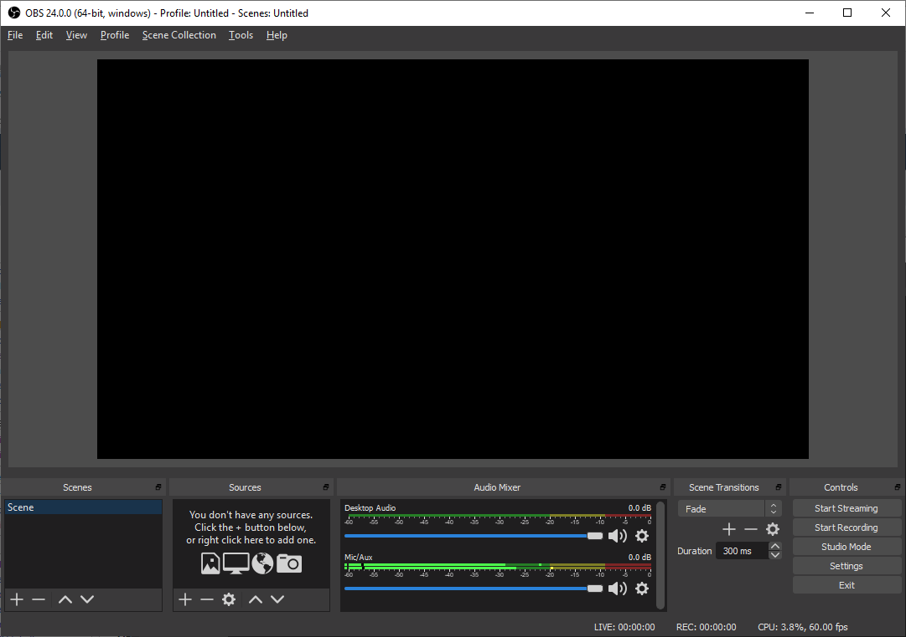

# Guia da Feministreamer

Olá! Você quer se tornar streamer?

Nesse guia, vamos te dar dicas e um tutorial básico de como começar a streamar, e compartilhar seu conhecimento e experiências com todes!

# O quê são lives?

Lives (ou livestreams se quisermos utilizar o termo original em inglês) são transmissões ao vivo, podendo ser feitas em várias plataformas diferentes como [Twitch](https://twitch.tv/), [Trovo](https://trovo.live/), [Youtube](https://youtube.com/),etc.

Nessas lives, a pessoa streamer produz algum tipo de conteúdo. A maior parte das lives são de jogos, mas também há outros conteúdos como leitura, conversa, co-working ou também **Live Coding**.

## Live Coding

**Live Coding** é uma categoria de criação de conteúdo onde uma pessoa cria códigos em uma transmissão ao vivo. O conteúdo deste tipo de live em específico pode variar de acordo com o que a pessoa streamer está trabalhando no momento podendo envolver desenvolvimento de jogos, sites, solução de desafios e até mesmo estudo de código ou conteúdos relacionados à área. 

Live Coding não é uma modalidade nova, sendo que já existe há cerca de 4 anos na Twitch global e há 2 na Twitch BR.

Geralmente, esse tipo de live envolve muita interação com o chat, que são as pessoas que estão assistindo a live e se comunicam com a pessoa streamer através de um chat de texto na palatforma onde a live está acontecendo. A **interação com o chat** é um dos pontos mais importantes da live, pois é ela que "fideliza" seus viwers e faz com que eles tenham vontade de assistir mais do seu conteúdo.

## Pessoas que produzem Live Coding

Algumas pessoas incríveis que produzem Live Coding estão na tabela abaixo:

|Streamer      |     Status      |
| ------------ | ---------------- |
|[Bug_elseif](https://twitch.tv/bug_elseif)||
|[Kastr0walker](https://twitch.tv/kastr0walker)||
|[LeonaDEV](https://twitch.tv/leonadev)||
|[Levxyca](https://twitch.tv/levxyca)||
|[MandysDev](https://twitch.tv/mandysdev)||
|[MidoriFukami](https://twitch.tv/midorifukami)||
|[Moniquelive](https://twitch.tv/moniquelive)||
|[Morgannadev](https://twitch.tv/morgannadev)||
|[Pachi Codes](https://twitch.tv/pachicodes)||
|[Pokemaobr](https://twitch.tv/pokemaobr)||
|[Profbrunolopes](https://twitch.tv/profbrunolopes)||
|[xTecna](https://twitch.tv/xtecna)||

Cada pessoa tem um cronograma diferente, fazendo suas lives em dias e horários diferentes. Caso no momento em que você esteja acessando este repositório nenhuma pessoa esteja com o status "live" na coluna de Status, você pode entrar nos perfis das pessoas e observar o cronograma de lives dela.

# Como começar?

## Assistindo pessoas que produzem Live Coding

Antes de começar a streamar, é recomendado que você assista lives para entender o ecossistema das lives e **não fazer uma live se você não consome live**. É importante que você assista lives para entender melhor o quê é live coding, lives no geral e principalmente a dinâmica deste tipo de produção de conteúdo.

Também é importante assistir lives para pegar inspirações de coisas para fazer na sua live, e coisas que são comuns de terem nas lives, como overlays, formas de falar com o chat, maneiras de apresentar seu conteúdo,etc.

## Aprendendo a lidar com o chat como telespectadora

Assistindo lives, você vai aprender como falar e lidar com o chat. No começo, pode ser mais difícil se soltar, falar de maneira mais informal com as pessoas do chat, mas se a pessoa streamer que está guiando a live for gentil e receptiva (como todas as pessoas listadas acima), chegando com educação na live, você terá uma ótima recepção todas as vezes que falar no chat.

# Comunidades

É muito interessante entrar em comunidades quando você começar a ver live coding. Muitas vezes, as pessoas streamers participam de comunidades de tecnologia também, buscando se unir e criar um ecossistema agradável de consumo, produção e divulgação de conteúdo.

Por isso é importante entrar em uma comunidade se você quer começar a consumir ou produzir lives. Algumas comunidades recomendadas são:

- [Feministech](https://feministech.github.io/)
- [A Caverna do Patocórnio](https://caverna.live/)
- [Kotlinautas](https://kotlinautas.dev/)

## Interagindo em comunidades

Interagir em comunidades pode ser difícil, principalmente se enturmar com uma comunidade já bem estabilizada. Porém, ao longo do tempo, essa dificuldade diminui, já que você acabará se acostumando a interagir e falar com as pessoas, ganhando intimidade com quem faz parte da comunidade onde você está inserida.

# Parte técnica

Para começar a fazer live, além de saber tópicos específicos sobre live coding, como falar com o chat, comunidades,etc. também é importante saber a parte técnica da utilização das plataformas, OBS, Overlays,etc. Essa seção é destinada à introdução desses tópicos.

## Plataformas

Existem diversas plataformas que podem ser utilizadas para você fazer as suas lives, mas as duas que a Feministech recomenda é a [Twitch](https://twitch.tv) e a [Trovo](https://trovo.live). Entre as duas, a Twitch é a plataforma mais utilizada (beeeem mais utilizada), mas a Trovo tem um suporte muito melhor caso você tenha algum problema. Uma vez que você comece a fazer livez em uma plataforma e não goste tanto da maneira como ela está estruturada, você também pode trocar de plataforma, migrando da Twitch para a Trovo por exemplo.

## OBS e StreamLabsOBS

Você irá precisar também de um programa para transmitir a sua live, levando a imagem (tanto da tela quanto da sua câmera caso você deseje utilizar câmera nas suas lives) e som que você está produzindo no seu computador até a plataforma.

Nesse assunto, temos dois programas bem conhecidos que fazem isso.

### OBS

O OBS (Open Broadcast Software) é o programa mais conhecido para fazer lives, ele tem essa interface abaixo:

OBS é um programa com diversas funções e capacidades, podendo ser usado até em lives imensas de grandes streamers.

Além de ser um programa gratuito, também é completamente Open Source, logo qualquer pessoa pode ajudar o programa contribuindo no projeto.

Para instalar o OBS, [baixe o software em seu site oficial](https://obsproject.com/) selecionando a versão compatível com o seu sistema operacional (Windows, MacOS ou Linux). Depois disso, instale o programa como qualquer outro.

### StreamLabsOBS

StreamLabsOBS é uma versão personalizada do OBS criada pela StreamLabs. Essa versão é bem mais simples de ser configurada que o OBS padrão, além de já vir com plugins que permitem colocar elementos visuais na tela como o chat da live, alertas, notificações,etc. Logo, é bem mais fácil de começar com ela.

O download do software pode ser feito através do site oficial [clicando aqui](https://streamlabs.com/). Assim como o OBS, após o término do download, você deve fazer a instalação do software.

# Fazendo sua primeira live

Depois de ter todo o seu ambiente configurado, agora é só abrir a sua primeira live, e praticar o incrível mundo do Live Coding!

## Boas Práticas

- Agradeça toda vez que uma raid ser enviada ao seu canal, principalmente quando você já conhece a pessoa que está fazendo a raid, pois a pessoa está confiando o público dela, no seu canal;
- Defina regras para seu chat, criando limites e punições para as pessoas do seu chat;
- Envie raids no final das suas lives para manter o seu público na plataforma e principalmente em uma pessoa streamer que você confia;

## Interagindo com o seu chat

Sempre faça constantes interações com as pessoas do seu chat, mantendo sempre uma conversa contínua e fluída. **Muitas vezes, mais importante que o código, é a conversa que está acontecendo em volta dele.**
